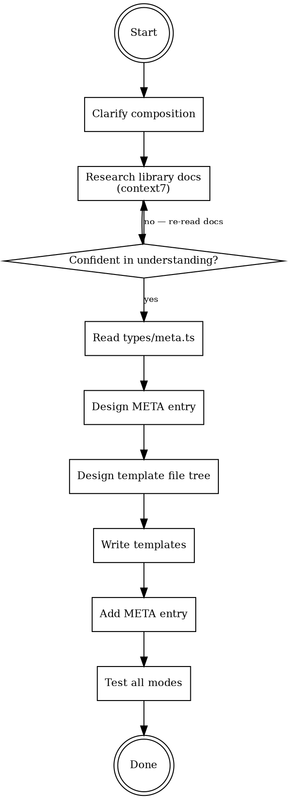

# Adding Blueprints to create-faster

## Overview

Create a new blueprint — a pre-composed, functional starter project. Blueprints combine existing building blocks (stacks, libraries, project addons) AND add opinionated application code (pages, layouts, components) to give users a working app out of the box.

**Core principle:** A blueprint is a functional application, not just a preset of libraries. Every blueprint must produce a working app that a user can run immediately after generation.

## When to Use

Use this skill when:
- Creating a new blueprint from scratch
- User describes a project type ("landing page with analytics", "AI chatbot app", "web3 dapp")
- User has a specific composition in mind ("nextjs + shadcn + motion + vercel-analytics")

Do NOT use for:
- Extracting a blueprint from an existing project (use `extracting-blueprints` skill first, then come here)
- Adding individual libraries or stacks (use `adding-templates` skill)
- Fixing existing blueprint templates (use `fixing-templates` skill)

## What is a Blueprint

A blueprint is a **complete starter project** that combines:

1. **A preset composition** — stacks, libraries, and project addons defined in `META.blueprints`
2. **Application code** — pages, layouts, components, routes in `templates/blueprints/{name}/`
3. **Extra dependencies** — blueprint-specific packages not covered by the composition (e.g., `recharts` for a dashboard)
4. **Extra env vars** — blueprint-specific environment variables

**How it works at generation time:**
1. Normal template resolution runs first (stacks → libraries → project addons → repo config)
2. Blueprint templates are collected from `templates/blueprints/{name}/`
3. Blueprint templates **override** any structural templates with the same destination path
4. Blueprint `packageJson` is merged into app packages
5. Blueprint `envs` are collected alongside library/project envs

**What blueprints do NOT do:**
- They don't change the CLI code — resolution is generic
- They don't define new stacks or libraries — they compose existing ones
- They can't have conflicting library selections — the composition must be valid per META rules

### Data Model (`MetaBlueprint` in `types/meta.ts`)

```typescript
interface MetaBlueprint {
  label: string;       // Display name in CLI
  hint: string;        // Description shown during selection
  category: string;    // Grouping category (e.g. 'Web3', 'Business')
  context: {
    apps: { appName: string; stackName: StackName; libraries: string[] }[];
    project: { database?: string; orm?: string };
  };
  packageJson?: PackageJsonConfig;  // Extra deps for the blueprint
  envs?: EnvVar[];                   // Extra env vars
}
```

### Override Semantics

Blueprint templates at `templates/blueprints/{name}/src/app/page.tsx.hbs` override the stack's `templates/stack/nextjs/src/app/page.tsx.hbs` because they resolve to the same destination path. The blueprint version wins.

This means:
- You only need blueprint templates for files you want to REPLACE or ADD
- Structural templates (tsconfig, tailwind config, etc.) are kept as-is
- Library templates (auth setup, query providers, etc.) are kept as-is

### Template Resolution for Blueprints

- Scans `templates/blueprints/{blueprintName}/`
- Supports stack suffixes: `file.tsx.nextjs.hbs` (filtered to matching stacks)
- Supports frontmatter with `only: mono|single` filtering
- Default scope is `app` (blueprints target the first app in turborepo)
- Frontmatter `mono.scope: root` available for root-level files

## The Process



### Phase 1: Clarify the Composition

If the user has a vague idea ("landing page with analytics"):
1. Ask what stack(s) — Next.js? TanStack Start? Multi-app with Hono backend?
2. Ask what libraries from existing META — shadcn? better-auth? tanstack-query?
3. Identify libraries NOT in create-faster yet — if needed, those must be added first via `adding-templates`
4. Ask about project addons — database? ORM? linter?
5. Identify extra dependencies specific to the blueprint

If the user already knows the composition:
1. Validate all stacks/libraries/addons exist in META
2. Validate the composition is valid (dependency rules: orm requires database, better-auth requires orm, etc.)
3. Identify extra blueprint-specific dependencies

**Output:** A clear composition spec:
```
Blueprint: landing-page
Apps: web (nextjs) + shadcn, tanstack-query
Project: biome
Extra deps: framer-motion, @vercel/analytics
Extra envs: ANALYTICS_ID
```

### Phase 2: Research Library Docs (context7) — HARD GATE

**THIS IS A BLOCKING PREREQUISITE. You CANNOT proceed to Phase 3 without completing this.**

You MUST use context7 (or web search) to read documentation for EVERY library in the composition AND every extra dependency. No exceptions — not for libraries you "know well," not for "simple" setups, not because "the user is waiting."

**Baseline testing showed agents skip this 100% of the time when not enforced.** The result: invented API signatures, wrong package names, outdated patterns, guessed version numbers. All of which produce broken blueprints.

For every library in the composition AND every extra dependency:

1. **Official setup guide** — how to set up this library with the chosen stack
2. **Integration patterns** — how libraries interact (e.g., shadcn + framer-motion animation patterns)
3. **Latest API** — current imports, function signatures, component APIs
4. **SSR/RSC patterns** — which components need `'use client'`, which can be server components
5. **Current stable version** — don't guess. Check npm or docs.

**For extra blueprint dependencies specifically:**
- What's the current stable version? (check npm/docs, don't invent)
- What are the required peer dependencies?
- What's the recommended setup pattern for the chosen stack?
- What's the correct package name? (packages get renamed, scoped, etc.)

**Output requirement:** Document specific findings per library. Don't just say "verified."

Example:
```
Finding: framer-motion v11 uses `motion` import directly, not `motion.div`.
         `import { motion } from 'framer-motion'` is the current API.
Differs: Many tutorials still show the old `motion.div` pattern.
Impact:  Blueprint templates must use the current `motion` component API.
```

**If you catch yourself thinking any of these, STOP:**
- "I know this library's API" → You might know an OLD version's API. Check.
- "This is a popular library, the API is stable" → Popular libraries have breaking changes too. Check.
- "I'll verify later" → You'll forget and ship broken code. Check NOW.
- "Context7 is slow, I'll skip it" → Broken blueprints are slower to fix. Use it.

### Phase 3: Read Type Definitions and Existing Templates

**Read `apps/cli/src/types/meta.ts`** to verify the `MetaBlueprint` interface and related types. Don't guess what fields are available.

**Read the existing structural templates** that the blueprint will interact with. Before designing any override, you MUST know what you're overriding:

1. Read `templates/stack/{stackName}/` — what files does the stack already generate?
2. Read `templates/libraries/{lib}/` — for each library in the composition, what files exist?
3. Read existing blueprint templates — `templates/blueprints/` for reference

**Why this matters:** Baseline testing showed agents assume files exist (e.g., "I'll override proxy.ts") without checking if the structural template actually generates that file. This produces overrides that don't match any destination path and just become orphan files.

### Phase 4: Design the META Entry

```typescript
'blueprint-name': {
  label: 'Display Name',
  hint: 'One-line description of what this blueprint creates',
  category: 'Category Name',
  context: {
    apps: [
      {
        appName: 'web',           // Default app name
        stackName: 'nextjs',
        libraries: ['shadcn', 'tanstack-query'],
      },
    ],
    project: {
      database: 'postgres',       // Optional
      orm: 'drizzle',            // Optional
    },
  },
  packageJson: {                  // Only blueprint-specific extras
    dependencies: {
      'framer-motion': '^11.0.0',
    },
  },
  envs: [                        // Only blueprint-specific extras
    {
      value: 'ANALYTICS_ID=your-analytics-id',
      monoScope: ['app'],
    },
  ],
},
```

**Key rules:**
- `context.apps[].libraries` must only reference libraries that exist in `META.libraries`
- `context.project` must only reference addons that exist in `META.project.{category}.options`
- `packageJson` should ONLY include extra dependencies not already declared by the composition's stacks/libraries/addons
- `envs` should ONLY include extra env vars not already declared by the composition's libraries/addons
- Validate dependency rules: if `better-auth` is in libraries, orm + database must be in project

### Phase 5: Design the Template File Tree

Map out every file the blueprint will add or override:

```
templates/blueprints/{name}/
  src/
    app/
      page.tsx.hbs                    # Override: replaces stack's default page
      (dashboard)/
        layout.tsx.hbs                # New: dashboard layout with sidebar
        page.tsx.hbs                  # New: dashboard home page
        settings/
          page.tsx.hbs               # New: settings page
    components/
      sidebar.tsx.hbs               # New: navigation sidebar
      header.tsx.hbs                # New: header component
```

**For each file, decide:**
- Is it an **override** (replaces a structural template) or an **addition** (new file)?
- Does it need a **stack suffix** (e.g., `.nextjs.hbs`) because it's framework-specific?
- Does it need **frontmatter** for custom path resolution?
- Does it need **Handlebars conditionals** for optional parts of the composition?

**Default behavior (no frontmatter needed):**
- Files resolve to `src/...` within the app directory
- In turborepo: `apps/{appName}/src/...`
- In single repo: `src/...`

**When you DO need frontmatter:**
- Root-level files: `mono: { scope: root }`
- Non-standard paths: `path: custom/path/file.ts`
- Repo-type filtering: `only: mono` or `only: single`

### Phase 6: Write Templates

For each template file:

1. **Write functional application code** — not placeholders, not lorem ipsum. Real, working code that demonstrates the blueprint's purpose.
2. **Use Handlebars context variables** where needed:
   - `{{projectName}}` for app name display
   - `{{#if (hasLibrary "x")}}` for optional library integration
   - `{{#if (isMono)}}` for import path differences
3. **Follow library best practices** from Phase 2 research — use current APIs, correct imports
4. **Keep it minimal but complete** — enough to be useful, not so much it's overwhelming to modify

**Handlebars escape gotcha:** When a template contains JSX with literal double curly braces (e.g., `style={{ color: 'red' }}`), Handlebars will try to interpret them. Use `\{{` to escape, or wrap blocks in `{{{{raw}}}}...{{{{/raw}}}}`. Test your templates — this is a common source of rendering errors.

**Template quality checklist per file:**
- [ ] Code actually works when rendered (no syntax errors, correct imports)
- [ ] Uses current library APIs (verified in Phase 2)
- [ ] `'use client'` directive where needed
- [ ] Import paths are correct for both single and turborepo modes
- [ ] No hardcoded project-specific values (use `{{projectName}}` etc.)
- [ ] Follows stack conventions (Next.js App Router patterns, etc.)
- [ ] JSX double curly braces properly escaped for Handlebars

### Phase 7: Implement

1. Add the META entry to `META.blueprints` in `__meta__.ts`
2. Create template files in `templates/blueprints/{name}/`
3. Verify no syntax errors in META (TypeScript compilation)

### Phase 8: Test

**Single repo mode:**
```bash
bunx create-faster test-single --blueprint {name} --git --pm bun
```

**Turborepo mode (add a second app to force turborepo):**
The blueprint defines one app, but adding a second via the CLI should also work. Test that blueprint templates resolve correctly in turborepo.

**Verify:**
- [ ] All blueprint template files present in output
- [ ] Override files correctly replaced structural templates
- [ ] `package.json` has correct dependencies (composition + blueprint extras)
- [ ] `.env.example` has correct variables (composition + blueprint extras)
- [ ] `bun install` succeeds
- [ ] `bun run dev` starts without errors
- [ ] The application is functional (pages render, routing works)
- [ ] CLI `--blueprint {name}` flag works
- [ ] Interactive mode shows the blueprint in the list

## Checklist

### Research (before writing ANY template)
- [ ] Composition is fully specified (stacks, libraries, project addons, extras)
- [ ] All stacks/libraries/addons exist in META (or flagged for creation first)
- [ ] Composition is valid per META dependency rules
- [ ] Read library docs via context7 for EVERY library and extra dependency
- [ ] Documented specific context7 findings (not just "verified")
- [ ] Read `types/meta.ts` to verify `MetaBlueprint` fields
- [ ] Extra dependencies identified with correct versions

### Implementation
- [ ] META entry designed with correct context, packageJson, envs
- [ ] META packageJson contains ONLY blueprint-specific extras (not composition deps)
- [ ] META envs contains ONLY blueprint-specific extras
- [ ] Template file tree designed with override/addition decisions
- [ ] Each template uses current library APIs (from docs research)
- [ ] Each template is functional code (not placeholders)
- [ ] Handlebars context variables used where needed
- [ ] Import paths handle mono vs single (if applicable)
- [ ] Stack-specific suffixes on framework-specific files

### Testing
- [ ] Single repo mode: generation works, app starts
- [ ] `--blueprint {name}` flag works
- [ ] Interactive mode lists the blueprint
- [ ] `package.json` correct (composition + extras merged)
- [ ] `.env.example` correct (composition + extras merged)
- [ ] `bun install && bun run dev` works

## Common Rationalizations — STOP

| Excuse | Reality |
|--------|---------|
| "I know this library, skip docs" | Libraries change. Check context7 for current API. |
| "Placeholder code is fine for now" | Blueprints must be functional. Users expect a working app. |
| "I'll add the extra deps to the library META" | Blueprint extras go in `blueprint.packageJson`, not library META. |
| "Skip testing, it's just templates" | Untested templates produce broken projects. Test both modes. |
| "The composition is obviously valid" | Check META dependency rules. better-auth needs orm needs database. |
| "I don't need frontmatter" | Default behavior is usually fine, but verify path resolution. |
| "I'll use the old API pattern" | Research first. Use current stable APIs from context7. |
| "Verified against docs" | Saying "verified" without specific findings is the same as not checking. |
| "I'll override proxy.ts" | Did you READ the existing stack templates to verify proxy.ts exists? Check first. |
| "The version is ^3.8.1" | Did you check npm/docs, or did you guess? Guessed versions break installs. |
| "I know the cookie name is privy-token" | Did you read the docs, or did you assume? Library internals change. |
| "Context7 is too slow for this" | Broken blueprints from wrong APIs are slower to debug. Use it. |

## Red Flags — You're About to Fail

**STOP immediately if you:**
- Start writing templates before researching all libraries via context7
- Write placeholder/lorem ipsum content instead of functional code
- Put composition dependencies in `blueprint.packageJson` (they belong in library/addon META)
- Skip the turborepo test
- Use outdated library APIs without checking docs
- Don't validate the composition against META dependency rules
- Say "verified" without writing what the docs actually say
- Design an override for a file you haven't confirmed exists in the structural templates
- Use a version number you didn't verify against npm/docs
- Write a library setup pattern from memory without checking current docs

## Quick Reference

| What | Where | How |
|------|-------|-----|
| Blueprint definition | `META.blueprints` in `__meta__.ts` | `label`, `hint`, `category`, `context`, `packageJson?`, `envs?` |
| Blueprint type | `MetaBlueprint` in `types/meta.ts` | Verify fields before designing |
| Blueprint templates | `templates/blueprints/{name}/` | `.hbs` files, override semantics |
| Override behavior | `template-resolver.ts` L288-293 | Blueprint destinations replace structural |
| Template authoring | See `adding-templates` skill | Frontmatter, helpers, stack suffixes |
| Package.json merge | `package-json-generator.ts` | Blueprint packageJson merged into app |
| Env generation | `env-generator.ts` | Blueprint envs collected with library/project envs |
| CLI flag | `--blueprint {name}` | Can combine with `--linter`/`--tooling`; exclusive with `--app`/`--database`/`--orm` |
| Interactive mode | `cli.ts` `blueprintCli()` | Prompts: project name, linter, tooling, git, pm |
