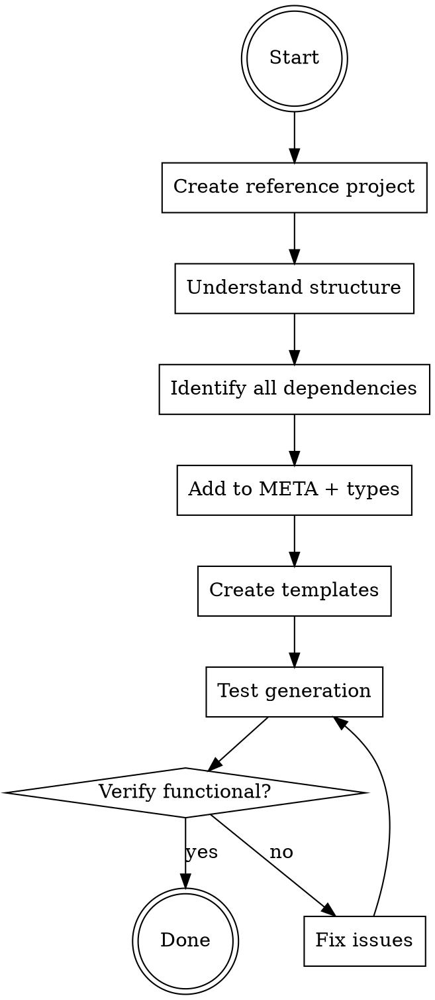

# Adding Stacks to create-faster

## Overview

Add new framework stacks (Next.js, Expo, Remix, Astro, etc.) to the create-faster CLI scaffolding tool with complete, functional templates.

**Core principle:** Understand-first, copy-second. Create a working reference project BEFORE writing templates.

## When to Use

Use this skill when:
- Adding a new app stack (Next.js, Remix, Astro, SvelteKit, etc.)
- Adding a new server stack (Hono, Express, Fastify, etc.)
- The framework is new to the create-faster tool

Do NOT use for:
- Fixing existing templates (use fixing-templates skill)
- Adding libraries to existing stacks
- Updating dependency versions

## Architecture Context

Adding a stack is **data-driven**. Most CLI code operates generically on META configuration. Only 2-3 source files need changes. Everything else is template creation.

**What does NOT change** when adding a stack (17+ files are generic):
- `cli.ts`, `flags.ts`, `index.ts` - iterate META entries
- `template-resolver.ts` - scans `templates/stack/{stackName}/`
- `package-json-generator.ts` - merges from `META.stacks[stackName].packageJson`
- `env-generator.ts` - collects envs from META
- `handlebars.ts` - generic helpers
- `addon-utils.ts` - generic compatibility checks
- All prompts, TUI, summary code

## The Systematic Process



### Step 1: Create Reference Project FIRST

**DO NOT skip this step. DO NOT assume you know the structure.**

1. Create temporary project with official CLI/starter:
   ```bash
   cd /tmp
   npm create [framework]@latest temp-[framework]
   # Follow prompts, select typical options
   ```

2. Inspect complete structure:
   ```bash
   tree -L 3 -I 'node_modules' temp-[framework]/
   ```

3. Read ALL critical files:
   - package.json (all dependencies & scripts)
   - Config files (vite.config, next.config, etc.)
   - Entry points (main.tsx, app.tsx, etc.)
   - Routing structure

**Why this matters:** Without reference project, you WILL miss dependencies, configs, and source files.

### Step 2: Understand Stack Architecture

Research the framework's unique characteristics:

1. **Build system:** Vite? Webpack? Custom?
2. **Routing:** File-based? Config-based? Library?
3. **Server rendering:** SSR? SSG? Hybrid?
4. **Entry points:** Where does code start?
5. **Config files:** What's required vs optional?

**Check official docs. DO NOT assume similarity to other frameworks.**

### Step 3: Identify ALL Dependencies

Create comprehensive dependency checklist from reference project's package.json.

**CRITICAL:** Copy version numbers EXACTLY as they appear in reference project. Do NOT:
- "Improve" to latest versions
- Guess at version numbers
- Use different versions across related packages

### Step 4: Add to Types and META

**Only 2-3 source files need code changes:**

#### a. Add to `StackName` union (`types/meta.ts`)

```typescript
export type StackName = 'nextjs' | 'expo' | 'hono' | 'tanstack-start' | 'newstack';
```

All downstream types derive from `StackName` automatically.

#### b. Add stack entry to META (`__meta__.ts`)

Dependencies and scripts are declared in META, NOT in template files. Package.json is generated programmatically by `package-json-generator.ts`.

```typescript
newstack: {
  type: 'app' | 'server',
  label: 'Framework Name',
  hint: 'Short description',
  packageJson: {
    dependencies: {
      'framework-core': '^1.0.0',
    },
    devDependencies: {
      typescript: '^5',
      '@types/node': '^20',
    },
    scripts: {
      dev: 'framework dev --port {{port}}',
      build: 'framework build',
      start: 'framework start --port {{port}}',
    },
  },
},
```

**Scripts with `{{port}}`:** The `package-json-generator.ts` resolves these placeholders:
- Turborepo: `{{port}}` → `3000 + appIndex` (e.g., `--port 3001`)
- Single repo: the `--port {{port}}` portion is stripped entirely

**There is NO `package.json.hbs` template file.** Package.json is 100% programmatic.

#### c. Add file extensions to KNOWN_EXTENSIONS (if needed, `lib/frontmatter.ts`)

If the framework uses a non-standard file extension (e.g., `.svelte`, `.vue`, `.astro`), add it to `KNOWN_EXTENSIONS` in `frontmatter.ts`. This prevents the stack suffix parser from misidentifying file extensions as stack names.

### Step 5: Create Template Structure

Templates go in `templates/stack/{stackname}/`. Only non-generated files need templates.

```
templates/stack/{stackname}/
  {config}.config.ts.hbs    # Vite, Next, etc.
  tsconfig.json.hbs         # TypeScript config
  src/                      # Source code structure
    {entry-point}.tsx.hbs   # Main entry
    routes/                 # Routing (if file-based)
    components/             # Shared components
  public/                   # Static assets (if needed)
```

**Files you do NOT create as templates:**
- `package.json` — generated programmatically from META `packageJson`
- `.env.example` — generated programmatically from META `envs`

**For each template file, you can use:**

1. **YAML frontmatter** for path resolution and filtering:
   ```yaml
   ---
   only: mono          # Only generate in turborepo mode
   mono:
     scope: app        # Where in monorepo (app|pkg|root)
     path: config.ts   # Override output path
   ---
   ```

2. **Handlebars conditionals** for runtime behavior:
   ```handlebars
   {{#if (isMono)}}
   "extends": "@repo/config/ts/base.json",
   {{/if}}
   ```

3. **Stack-specific file suffix** for library templates:
   ```
   route.ts.nextjs.hbs → only included when stack is nextjs
   ```

**Available Handlebars helpers:**
- `isMono` — check if turborepo
- `hasLibrary "name"` — check if current app has library
- `has "category" "value"` — check database/orm/tooling
- `hasContext "key"` — check if key exists in context
- `appPort appName` — get port for app (3000 + index)
- `eq`, `ne`, `and`, `or` — logical operators

### Step 6: Update Library Compatibility (if needed)

Check existing libraries in `META.libraries`. Libraries with `support: { stacks: 'all' }` will automatically be available for the new stack. Verify this makes sense (e.g., React libraries shouldn't be available for non-React frameworks).

If a library with `stacks: 'all'` doesn't make sense for the new stack, change it to an explicit stack list:
```typescript
support: { stacks: ['nextjs', 'tanstack-start'] },  // React-only
```

### Step 7: Test Template Generation

**DO NOT assume templates work. Verify.**

1. Test generation in single repo mode:
   ```bash
   cd /tmp && bun run dev:cli
   # Or: bunx create-faster test-single --app test-single:{stackname}
   ```

2. Verify generated files:
   - All template files present
   - `package.json` has correct dependencies (from META)
   - No extra/missing files

3. Test build works:
   ```bash
   cd test-single && bun install && bun run dev
   ```

4. Test in turborepo mode:
   ```bash
   bunx create-faster test-turbo \
     --app web:{stackname} \
     --app api:hono
   ```

5. Verify turborepo specifics:
   - Files in `apps/{appName}/`
   - `tsconfig.json` extends `@repo/config/ts/base.json`
   - Scripts have port numbers

**If ANY errors:** Fix templates/META, regenerate, re-test.

## Checklist - All Steps Required

- [ ] Created reference project with official CLI
- [ ] Inspected all files (package.json, configs, source)
- [ ] Understood framework-specific patterns
- [ ] Added to `StackName` union in `types/meta.ts`
- [ ] Added META entry with `packageJson` (dependencies + scripts)
- [ ] Added file extension to `KNOWN_EXTENSIONS` (if applicable)
- [ ] Created template directory under `templates/stack/{stackname}/`
- [ ] Created ALL source file templates (entry, routes, components)
- [ ] Did NOT create `package.json.hbs` (it's programmatic)
- [ ] Did NOT create `.env.example.hbs` (it's programmatic)
- [ ] Used YAML frontmatter where needed (not magic comments)
- [ ] Tested generation in single repo mode
- [ ] Tested generation in turborepo mode
- [ ] Verified dev server starts
- [ ] Verified build completes
- [ ] Checked library compatibility (no React libs for non-React stacks)

## Special Filename Handling

**create-faster naming conventions:**
- `__filename` → `.filename` (for dotfiles like `.gitignore`, `.env`)
- To create files that literally start with `__`, use triple underscore:
  - `___root.tsx.hbs` → `__root.tsx`
  - `__root.tsx.hbs` → `.root.tsx` (WRONG)

## Common Rationalizations - STOP

| Excuse | Reality |
|--------|---------|
| "I'll copy Next.js and adapt" | Each framework is unique. You WILL miss things. |
| "Config files are enough" | Without source files, nothing runs. |
| "I know this framework" | Create reference anyway. Starters evolve. |
| "I'll add source later" | Templates must be complete NOW. |
| "I need a package.json.hbs" | Package.json is generated programmatically from META. No template file. |
| "I'll use magic comments" | Magic comments were removed. Use YAML frontmatter. |
| "Close enough, it'll probably work" | Probably = definitely broken. Test it. |
| "I can skip testing" | Untested templates = broken templates. |
| "Triple underscore? That's weird" | Naming edge case from testing. Use it or file breaks. |

## Red Flags - You're About to Fail

**STOP immediately if you think:**
- "I'll just look at [other stack] first"
- "Config files should be enough to start"
- "I need to create a package.json template"
- "I'll use @dest: or @scope: magic comments"
- "The env template goes in templates/"
- "I'll add modules inside the stack directory"
- "It's probably similar to [other framework]"

These thoughts = baseline failure pattern. Follow the process.

## Quick Reference

| What | Where | How |
|------|-------|-----|
| Stack definition | `META.stacks` in `__meta__.ts` | `type`, `label`, `hint`, `packageJson` |
| Type union | `StackName` in `types/meta.ts` | Add new literal |
| Template files | `templates/stack/{stackname}/` | `.hbs` files with optional frontmatter |
| Package.json | Programmatic from META | `package-json-generator.ts` |
| Env vars | Declared in META `envs` | `env-generator.ts` |
| Libraries | `META.libraries` (separate) | Check `support.stacks` compatibility |
| File extensions | `KNOWN_EXTENSIONS` in `frontmatter.ts` | Add if non-standard |
| Frontmatter | YAML at top of `.hbs` file | `path`, `mono`, `only` fields |
| Helpers | `handlebars.ts` | `isMono`, `hasLibrary`, `has`, `hasContext`, `appPort` |
