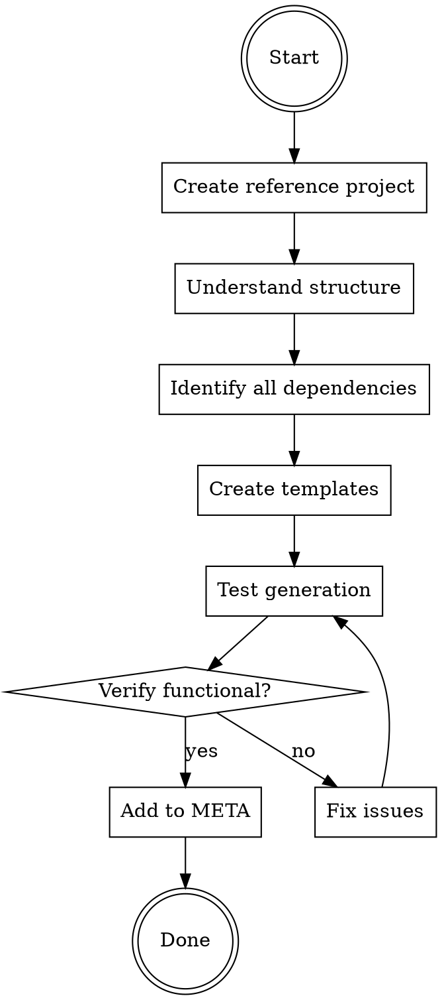

# Adding Stacks to create-faster

## Overview

Add new framework stacks (Next.js, Expo, Remix, Astro, etc.) to the create-faster CLI scaffolding tool with complete, functional templates.

**Core principle:** Understand-first, copy-second. Create a working reference project BEFORE writing templates.

## When to Use

Use this skill when:
- Adding a new app stack (Next.js, Remix, Astro, SvelteKit, etc.)
- Adding a new server stack (Hono, Express, Fastify, etc.)
- The framework is new to the create-faster tool

Do NOT use for:
- Fixing existing templates (use fixing-templates skill)
- Updating dependencies (use updating-dependencies skill)
- Adding modules to existing stacks

## The Systematic Process



### Step 1: Create Reference Project FIRST

**DO NOT skip this step. DO NOT assume you know the structure.**

1. Create temporary project with official CLI/starter:
   ```bash
   cd /tmp
   npm create [framework]@latest temp-[framework]
   # Follow prompts, select typical options
   ```

2. Inspect complete structure:
   ```bash
   tree -L 3 -I 'node_modules' temp-[framework]/
   ```

3. Read ALL critical files:
   - package.json (all dependencies & scripts)
   - Config files (vite.config, next.config, etc.)
   - Entry points (main.tsx, app.tsx, etc.)
   - Routing structure

**Why this matters:** Without reference project, you WILL miss dependencies, configs, and source files.

### Step 2: Understand Stack Architecture

Research the framework's unique characteristics:

1. **Build system:** Vite? Webpack? Custom?
2. **Routing:** File-based? Config-based? Library?
3. **Server rendering:** SSR? SSG? Hybrid?
4. **Entry points:** Where does code start?
5. **Config files:** What's required vs optional?

**Check official docs:**
- Getting Started guide
- Project Structure docs
- Configuration reference

**DO NOT assume similarity to other frameworks.** Each has unique patterns.

### Step 3: Identify ALL Dependencies

Create comprehensive dependency checklist from reference project:

**Core Dependencies:**
- [ ] Framework runtime packages
- [ ] Router library (if separate)
- [ ] Build tool (vite, webpack, etc.)
- [ ] Server runtime (if needed)

**Dev Dependencies:**
- [ ] TypeScript types
- [ ] Build plugins
- [ ] Dev tools
- [ ] Linters/formatters (if included by default)

**Common Mistakes:**
- Missing build plugins (critical!)
- Wrong package versions
- Missing peer dependencies
- Incorrect package names

**Verification:** Compare your list to reference package.json line-by-line.

**CRITICAL:** Copy version numbers EXACTLY as they appear in reference project. Do NOT:
- "Improve" to latest versions
- Guess at version numbers
- Use different versions across related packages
- Example: If reference has `^1.132.0`, use `^1.132.0` NOT `^1.134.13`

### Step 4: Create Template Structure

Map reference project to create-faster structure:

```
templates/stack/[stackname]/
  package.json.hbs          # Dependencies + scripts
  [config].config.ts.hbs    # Vite, Next, etc.
  tsconfig.json.hbs         # TypeScript config
  src/                      # Source code structure
    [entry-point].tsx.hbs   # Main entry
    routes/                 # Routing (if file-based)
      __root.tsx.hbs
      index.tsx.hbs
    components/             # Shared components
  public/                   # Static assets (if needed)
```

**For each template file:**

1. **Add magic comments if needed:**
   ```handlebars
   {{!-- @repo:turborepo --}}
   {{!-- @scope:app --}}
   ```

2. **Add Handlebars conditionals:**
   ```handlebars
   {{#if (eq repo "turborepo")}}
   "@repo/config": "*",
   {{/if}}
   ```

3. **Handle ORM/database integration:**
   ```handlebars
   {{#if (eq orm "drizzle")}}
   "drizzle-orm": "^0.38.3",
   {{/if}}
   ```

**Copy working code from reference project, adapt with Handlebars.**

### Step 5: Test Template Generation

**DO NOT assume templates work. Verify.**

1. Test generation in single repo mode:
   ```bash
   cd /tmp
   bun create-faster test-single --stack [stackname]
   ```

2. Verify generated files:
   ```bash
   tree test-single/
   cat test-single/package.json
   ```

3. Test build works:
   ```bash
   cd test-single
   bun install
   bun run dev  # Should start without errors
   ```

4. Test in turborepo mode:
   ```bash
   cd /tmp
   bun create-faster test-turbo \
     --app web:[stackname] \
     --app api:hono
   ```

**If ANY errors:** Fix templates, regenerate, re-test. Repeat until clean.

### Step 6: Add to META

Only after templates are verified working:

```typescript
// apps/cli/src/__meta__.ts
META.stacks['stackname'] = {
  type: 'app' | 'server',
  scope: 'app',
  label: 'Framework Name',
  hint: 'Short description',
  modules: {
    'Category Name': {
      'module-id': {
        label: 'Module Label',
        hint: 'What it does',
        packageName: 'optional-package-name',
      },
    },
  },
}
```

**Choosing modules:**
- Research popular ecosystem libraries
- Check community templates for common patterns
- Add 2-5 essential modules (not all possible)
- Can expand later

### Step 7: Test with Modules

If you added modules, test them:

1. Generate with module enabled:
   ```bash
   bun create-faster test-module \
     --stack [stackname]:[module-id]
   ```

2. Verify module templates rendered correctly

3. Test build with module active

## Checklist - All Steps Required

Before considering task complete:

- [ ] Created reference project with official CLI
- [ ] Inspected all files (package.json, configs, source)
- [ ] Understood framework-specific patterns
- [ ] Created complete template structure (not just configs)
- [ ] Added ALL dependencies from reference
- [ ] Added ALL config files from reference
- [ ] Created source file templates (entry, routes, components)
- [ ] Tested generation in single repo mode
- [ ] Tested generation in turborepo mode
- [ ] Verified dev server starts
- [ ] Verified build completes
- [ ] Added to __meta__.ts with appropriate modules
- [ ] Tested module generation (if modules added)

## Special Filename Handling

**create-faster naming conventions:**
- `__filename` → `.filename` (for dotfiles like `.gitignore`, `.env`)
- To create files that literally start with `__`, use triple underscore:
  - `___root.tsx.hbs` → `__root.tsx` ✅
  - `__root.tsx.hbs` → `.root.tsx` ❌

**Examples:**
- TanStack Start: `___root.tsx.hbs` (needs literal `__root.tsx`)
- Next.js App Router: No issue (uses `app/` directory, not `__` files)

## Common Rationalizations - STOP

| Excuse | Reality |
|--------|---------|
| "I'll copy Next.js and adapt" | Each framework is unique. You WILL miss things. |
| "Config files are enough" | Without source files, nothing runs. |
| "I know this framework" | Create reference anyway. Starters evolve. |
| "I'll add source later" | Templates must be complete NOW. |
| "Close enough, it'll probably work" | Probably = definitely broken. Test it. |
| "Just package.json for now" | Incomplete = non-functional. Do it right. |
| "I can skip testing" | Untested templates = broken templates. |
| "Vinxi and Vite are the same" | Assumptions like this cause failures. Verify. |
| "Triple underscore? That's weird" | Naming edge case from testing. Use it or file breaks. |

## Red Flags - You're About to Fail

**STOP immediately if you think:**
- "I'll just look at [other stack] first"
- "Config files should be enough to start"
- "I can add [critical part] later"
- "It's probably similar to [other framework]"
- "I don't need to test, it should work"

These thoughts = baseline failure pattern. Follow the process.

## Quick Reference - File Checklist

**Minimum required files:**
- ✅ package.json.hbs (complete dependencies)
- ✅ Config file(s) (vite.config, next.config, etc.)
- ✅ tsconfig.json.hbs
- ✅ Entry point (main.tsx, app.tsx, etc.)
- ✅ At least one route/page
- ✅ Basic component structure (if framework uses components)
- ✅ public/ directory (if framework needs it)

**If ANY missing:** Templates incomplete. Keep working.

## Real-World Impact

**Without this skill (baseline):**
- 20 minutes → broken templates
- Missing 10+ dependencies
- Zero source files
- Would not run at all

**With this skill:**
- 30-40 minutes → functional templates
- All dependencies present
- Complete source structure
- Verified working build

**Extra 10-20 minutes = difference between broken and working.**

## Example: Adding TanStack Start

Reference the baseline test in `/tmp/baseline-adding-tanstack-start.md` to see all the mistakes this skill prevents.
