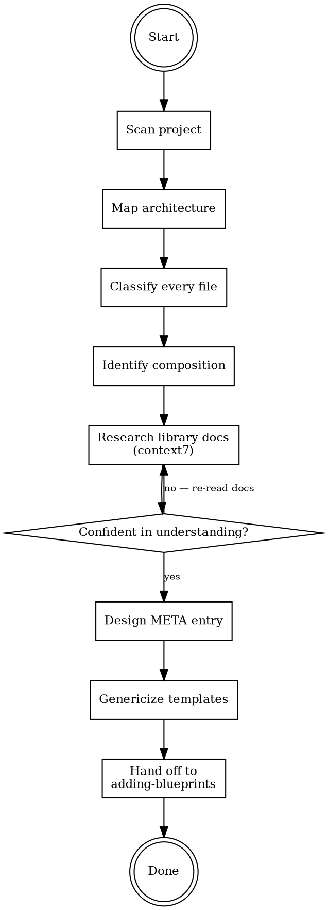

# Extracting Blueprints from External Projects

## Overview

Extract a real-world project and convert it into a generic, functional create-faster blueprint. The external project is a **reference for understanding the architecture and patterns**, not a source to copy-paste from.

**Core principle:** Understand the project's architecture, identify the generic patterns, strip the business logic, verify everything against current library docs, then build a clean blueprint. The project shows you WHAT to build — the docs tell you HOW to build it correctly.

## When to Use

Use this skill when:
- You have a working project and want to make it a create-faster blueprint
- The user says "I built a CRM, let's extract a dashboard blueprint from it"
- Converting project-specific code into a generic starter

Do NOT use for:
- Creating a blueprint from scratch without a reference project (use `adding-blueprints` skill directly)
- Extracting a single library integration (use `extracting-templates` skill)
- Fixing existing blueprints (use `fixing-templates` skill)

## What is a Blueprint

A blueprint is a **complete starter project** that combines:

1. **A preset composition** — stacks, libraries, and project addons defined in `META.blueprints`
2. **Application code** — pages, layouts, components, routes in `templates/blueprints/{name}/`
3. **Extra dependencies** — blueprint-specific packages not covered by the composition
4. **Extra env vars** — blueprint-specific environment variables

**How it works at generation time:**
1. Normal template resolution runs (stacks → libraries → project addons → repo config)
2. Blueprint templates are collected from `templates/blueprints/{name}/`
3. Blueprint templates **override** structural templates with the same destination path
4. Blueprint `packageJson` is merged into app packages
5. Blueprint `envs` are collected alongside library/project envs

**Key distinction from library extraction:** Extracting a library (`extracting-templates`) is surgical — one concern, one setup. Extracting a blueprint is architectural — you're extracting an entire application's structure, patterns, and flows while stripping domain-specific business logic.

### Data Model (`MetaBlueprint` in `types/meta.ts`)

```typescript
interface MetaBlueprint {
  label: string;
  hint: string;
  context: {
    apps: { appName: string; stackName: StackName; libraries: string[] }[];
    project: { database?: string; orm?: string; linter?: string; tooling: string[] };
  };
  packageJson?: PackageJsonConfig;
  envs?: EnvVar[];
}
```

## The Process



### Phase 1: Scan the Project

User tells you: project path + what kind of blueprint to extract.

1. **Scan the file tree** — get the complete directory structure
2. **Read `package.json`** — map all dependencies and their versions
3. **Identify the stack** — Next.js? Expo? Hono? Multi-app?
4. **Identify the routing structure** — pages, layouts, route groups
5. **Map the component tree** — shared components, page-specific components

**Output:** A complete file map with initial purpose annotations.

Example for a CRM project:
```
src/app/page.tsx                         → Landing/redirect
src/app/(dashboard)/layout.tsx           → Dashboard shell (sidebar + header)
src/app/(dashboard)/page.tsx             → Dashboard overview
src/app/(dashboard)/clients/page.tsx     → Client list (BUSINESS LOGIC)
src/app/(dashboard)/clients/[id]/page.tsx → Client detail (BUSINESS LOGIC)
src/app/(dashboard)/settings/page.tsx    → Settings page
src/components/sidebar.tsx               → Navigation sidebar
src/components/header.tsx                → App header
src/components/client-table.tsx          → Data table (BUSINESS LOGIC)
src/components/stats-cards.tsx           → Generic stat cards
src/lib/auth.ts                          → Auth setup (covered by better-auth)
src/lib/db.ts                            → DB setup (covered by drizzle)
```

### Phase 2: Map the Architecture

Understand the project's architectural patterns:

1. **Layout structure** — how are layouts nested? Route groups?
2. **Auth flow** — protected routes, auth middleware, session handling
3. **Data fetching** — server components, client queries, API calls
4. **Component patterns** — which shadcn components are used? Custom components?
5. **State management** — client state, server state, URL state
6. **Routing patterns** — dynamic routes, route groups, parallel routes

**Focus on the GENERIC patterns, not the domain-specific implementations.**

The CRM's client list page uses a data table with server-side pagination — that's a generic pattern worth keeping. The specific columns (client name, email, contract value) are business logic to strip.

### Phase 3: Classify Every File

For each file in the project, classify it:

| Classification | Action | Example |
|---------------|--------|---------|
| **Already covered by create-faster** | Skip — stacks/libraries/addons handle this | `tailwind.config.ts`, `next.config.ts`, auth setup, DB schema |
| **Generic application pattern** | Keep — this becomes a blueprint template | Dashboard layout, sidebar, header, stats cards, settings page |
| **Business logic** | Strip — domain-specific, not reusable | Client table columns, specific API routes, custom schemas |
| **Config/boilerplate** | Skip or genericize | `.env` values, API keys, hardcoded URLs |
| **Extra dependency usage** | Keep + add to blueprint packageJson | recharts charts, framer-motion animations |

**Critical question for each file:** "Would this file be useful in ANY project of this type, or only in THIS specific project?"

- Dashboard layout with sidebar → useful in any dashboard → KEEP
- Client management CRUD → specific to this CRM → STRIP
- Stats card component with hardcoded metrics → genericize the component, strip the specific metrics → KEEP (genericized)

### Phase 4: Identify the Composition

From the project's dependencies and code, map what goes where:

**Existing create-faster building blocks:**
```
Stack: nextjs
Libraries: shadcn, better-auth, tanstack-query
Project: postgres, drizzle, biome
```

**Blueprint-specific extras (NOT in create-faster):**
```
Dependencies: recharts, framer-motion
Env vars: ADMIN_EMAIL
```

**Verify each library exists in `META.libraries`.** If a library the project uses doesn't exist in create-faster yet, it must be added FIRST via the `adding-templates` skill before the blueprint can reference it.

**Validate the composition:** Check META dependency rules (orm requires database, better-auth requires orm, etc.).

### Phase 5: Research Library Docs (context7) — HARD GATE

**THIS IS A BLOCKING PREREQUISITE. You CANNOT proceed to Phase 6 without completing this.**

You MUST use context7 (or web search) to read documentation for EVERY library in the composition AND every extra dependency. No exceptions — not for libraries you "know well," not because "the project already works," not because "I can just copy the project's pattern."

**Baseline testing showed agents skip this 100% of the time when not enforced.** The result: code copied directly from the project with patterns described as "identical to CRM" — no verification that the APIs are current, that the patterns are recommended, or that the versions are stable.

**The project is ONE implementation, possibly months or years old. The docs are the source of truth.**

For EVERY library in the composition AND every extra dependency:

1. **Official setup guide** — current recommended setup
2. **Latest API** — current imports, function signatures, component APIs
3. **Integration patterns** — how libraries work together in the current version
4. **SSR/RSC patterns** — `'use client'` requirements, server component compatibility
5. **Breaking changes** — has the API changed since the project was built?
6. **Current stable version** — don't use the project's version blindly. Check npm/docs.

**What to verify against docs:**
- Are the project's imports correct and up-to-date?
- Is there a newer/better API for what the project does?
- Are there deprecated patterns the project uses that should be updated?
- What's the correct way to set up each library with the chosen stack?

**Output requirement:** Document specific findings for each library. Don't just say "verified."

Example:
```
Finding: recharts v2.15 has a new `ResponsiveContainer` that auto-sizes without
         explicit width/height props when using CSS container queries.
Differs: Project uses explicit width="100%" height={350} pattern.
Impact:  Blueprint templates should use the current pattern but keep explicit
         sizing as it's more predictable across browsers.

Finding: framer-motion was renamed to just "motion" in v12. Import is now
         `import { motion } from "motion/react"`.
Differs: Project uses `import { motion } from "framer-motion"` (v11 API).
Impact:  Check latest stable version — if v11 is still widely used, keep it.
         If v12 is stable, use the new import.
```

**If you catch yourself thinking any of these, STOP:**
- "The project works, the patterns are fine" → The project may use deprecated APIs. Check.
- "I'll just templatize the project's code" → That's copy-paste, not extraction. Verify against docs.
- "I know this library" → You might know an old version. Check.
- "Context7 is too slow" → Broken blueprints from wrong APIs are slower to debug. Use it.

### Phase 5b: Verify Existing Create-Faster Templates

**Before genericizing anything, read what create-faster already generates.**

1. Read `templates/stack/{stackName}/` — what files does the stack produce?
2. Read `templates/libraries/{lib}/` — for each library in the composition
3. Read existing blueprint templates in `templates/blueprints/`

**Why this matters:** Baseline testing showed agents assume files exist (e.g., "this overrides the structural proxy.ts") without checking. This produces overrides that target nonexistent files, or duplicate files that are already generated by the structural templates.

For each file classified as "Already covered by create-faster" in Phase 3, VERIFY by reading the actual template. Don't assume — read.

### Phase 6: Design the META Entry

**Before designing, read `apps/cli/src/types/meta.ts`** to verify the `MetaBlueprint` interface.

Based on Phase 4 (composition) and Phase 5 (research):

```typescript
'blueprint-name': {
  label: 'Display Name',
  hint: 'One-line description',
  context: {
    apps: [
      {
        appName: 'web',
        stackName: 'nextjs',
        libraries: ['shadcn', 'better-auth', 'tanstack-query'],
      },
    ],
    project: {
      database: 'postgres',
      orm: 'drizzle',
      linter: 'biome',
      tooling: [],
    },
  },
  packageJson: {
    dependencies: {
      recharts: '^2.15.0',     // Blueprint-specific only
    },
  },
  envs: [
    {
      value: 'ADMIN_EMAIL=admin@example.com',
      monoScope: ['app'],
    },
  ],
},
```

**Rules:**
- `packageJson` contains ONLY extras not covered by composition
- `envs` contains ONLY extras not covered by composition
- All libraries in `context.apps[].libraries` must exist in `META.libraries`
- Composition must be valid per META dependency rules
- Dependency versions come from docs research, not blindly from the project

### Phase 7: Genericize Templates

Transform the project's files into blueprint templates. This is the core of the extraction work.

**For each file classified as "Generic application pattern" in Phase 3:**

1. **Strip business logic** — remove domain-specific content
   - Client table → generic data table with placeholder columns
   - CRM-specific API routes → remove entirely
   - Domain schemas → remove (ORM schema handled by create-faster)

2. **Replace hardcoded values** with Handlebars variables
   - Project name → `{{projectName}}`
   - App-specific imports → `{{#if (isMono)}}@repo/...{{else}}@/...{{/if}}`

3. **Add Handlebars conditionals** for optional parts
   - Auth-dependent UI → `{{#if (hasLibrary "better-auth")}}`
   - Library-specific imports → conditional on library presence

4. **Use current library APIs** — from Phase 5 research, NOT from the project
   - If the project uses an old API, update to current
   - If the project has a workaround for a fixed bug, remove the workaround

5. **Keep it functional but minimal**
   - Enough code to demonstrate the pattern
   - Not so much that it's overwhelming to modify
   - Replace specific data with realistic but generic placeholder data

**Example transformation:**

Project file (CRM sidebar):
```tsx
const navigation = [
  { name: 'Dashboard', href: '/dashboard', icon: LayoutDashboard },
  { name: 'Clients', href: '/dashboard/clients', icon: Users },
  { name: 'Contracts', href: '/dashboard/contracts', icon: FileText },
  { name: 'Invoices', href: '/dashboard/invoices', icon: Receipt },
  { name: 'Settings', href: '/dashboard/settings', icon: Settings },
];
```

Blueprint template (generic sidebar):
```handlebars
const navigation = [
  { name: 'Dashboard', href: '/dashboard' },
  { name: 'Settings', href: '/dashboard/settings' },
];
```

Removed: domain-specific pages (Clients, Contracts, Invoices), icons (user can add their own).

### Phase 8: Hand Off to `adding-blueprints`

With the research complete and templates genericized, hand off to the `adding-blueprints` skill for:
- Adding the META entry to `__meta__.ts`
- Creating template files in `templates/blueprints/{name}/`
- Testing single + turborepo modes
- Verifying the generated app works

Provide the `adding-blueprints` skill with:
1. The designed META entry
2. The complete list of template files with their content
3. Doc research findings (so the implementation skill can verify)
4. Override vs addition classification for each template

## Checklist

### Research (before writing ANY template)
- [ ] Scanned the complete project file tree
- [ ] Read `package.json` for all dependencies
- [ ] Mapped the architectural patterns (layouts, routing, auth, data fetching)
- [ ] Classified every file (covered by create-faster / generic pattern / business logic / config)
- [ ] Identified the composition (stacks, libraries, project addons)
- [ ] Identified extra blueprint-specific dependencies
- [ ] Verified all libraries exist in `META.libraries` (flagged missing ones for creation)
- [ ] Validated composition against META dependency rules
- [ ] Read library docs via context7 for EVERY library and extra dependency (HARD GATE)
- [ ] Documented specific context7 findings (not just "verified")
- [ ] Read existing create-faster templates to verify what's already generated
- [ ] Read `types/meta.ts` to verify `MetaBlueprint` fields
- [ ] Designed META entry with correct context, packageJson, envs

### Extraction (after research is complete)
- [ ] Stripped all business logic from template files
- [ ] Replaced hardcoded values with Handlebars variables
- [ ] Added Handlebars conditionals for optional library integrations
- [ ] Updated all code to use current library APIs (from docs, not project)
- [ ] Each template is functional code (not placeholders)
- [ ] Each template is minimal but complete
- [ ] Handed off to `adding-blueprints` for implementation and testing

## Common Rationalizations — STOP

| Excuse | Reality |
|--------|---------|
| "The project code works, just templatize it" | Project code may be outdated, use deprecated APIs, or have workarounds for fixed bugs. Check docs. |
| "I know this library" | Docs evolve. Check context7 for current API and best practices. |
| "This business logic is generic enough" | If it references domain concepts (clients, invoices, contracts), it's business logic. Strip it. |
| "Skip context7, I'll use the project as reference" | The project is ONE implementation, possibly outdated. Docs are the source of truth. |
| "I'll keep all the pages" | Only keep pages that make sense in ANY project of this type. A CRM's client page is not generic. |
| "The project's dependency versions are fine" | Check latest stable versions. The project may be months or years behind. |
| "I verified against docs" | Saying "verified" without specific findings is the same as not checking. Document what you found. |
| "This component is too complex to strip" | If you can't strip it to a generic version, it's probably business logic. Remove it. |
| "The project uses library X, so require it" | Check if the library is in META. If not, it needs `adding-templates` first, or it's a blueprint extra. |
| "I'll figure out what's generic later" | Classify EVERY file in Phase 3. Don't start writing templates without a complete classification. |
| "Identical to the project" | If your template is "identical" to the project, you didn't do the work. Verify against docs, update APIs, strip specifics. |
| "I'll use the project's versions" | The project may be months old. Check npm/docs for current stable versions. |
| "This overrides the structural proxy.ts" | Did you READ the structural templates to verify proxy.ts exists? Check first. |

## Red Flags — You're About to Fail

**STOP immediately if you:**
- Start writing templates before reading library docs via context7
- Copy a file from the project without understanding every line
- Describe a template as "identical to" or "same as" the project code
- Keep domain-specific pages (clients, invoices, etc.) in the blueprint
- Use the project's dependency versions without checking current stable
- Skip the file classification phase
- Skip reading existing create-faster templates before designing overrides
- Don't document context7 findings
- Say "verified" without writing what the docs actually say
- Put composition dependencies in `blueprint.packageJson` (they belong in library/addon META)
- Reference a library in `context.apps[].libraries` that doesn't exist in `META.libraries`
- Try to do everything in one pass instead of handing off to `adding-blueprints`

These shortcuts produce blueprints that work for ONE project's setup but break for others.
