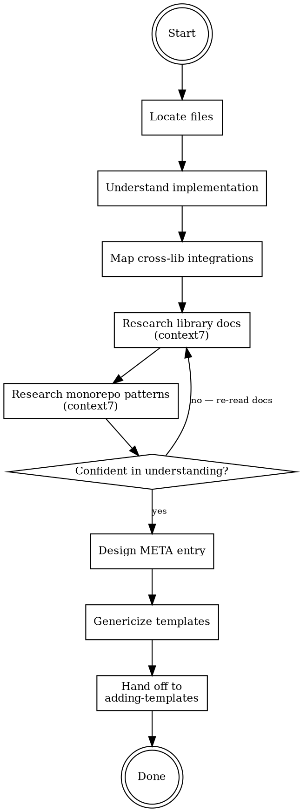

# Extracting Templates from External Projects

## Overview

Extract a library or feature implementation from a real project and convert it into generic, production-ready create-faster templates. The external project is a **starting point for understanding the use case**, not a source to copy from.

**Core principle:** Understand the library deeply through docs and real usage, then write generic templates. Never copy-paste from a project.

## When to Use

Use this skill when:
- You have a working implementation in an external project and want to make it a create-faster addon
- The user says "I used X in this project, let's add it to create-faster"
- Converting project-specific code into generic templates

Do NOT use for:
- Adding templates without an external reference project (use `adding-templates` skill directly)
- Fixing existing templates (use `fixing-templates` skill)

## The Process



### Phase 1: Locate

Find all files related to the feature in the external project.

1. User tells you: project path + what to extract
2. Search the project for related files:
   - Grep for import statements referencing the library
   - Check `package.json` for related dependencies and versions
   - Map the complete file tree for the feature

**Output:** A file list with each file's role.

Example for tRPC:
```
src/trpc/trpc.ts              → Server init, context, procedures
src/trpc/router.ts            → Root router combining domain routers
src/trpc/query-client.ts      → QueryClient factory
src/trpc/query-providers.tsx   → Client provider setup
src/trpc/server.tsx           → RSC proxy + HydrateClient
src/app/api/trpc/[trpc]/route.ts → API catch-all route
```

### Phase 2: Understand

Read each file and classify every piece of code:

| Classification | Action |
|---------------|--------|
| Library boilerplate | Keep — this is the generic setup |
| Integration with other libs | Keep conditionally — Handlebars `{{#if (hasLibrary "x")}}` |
| Business logic | Strip — domain routers, custom procedures, specific schemas |
| Project-specific config | Generalize — hardcoded URLs, app names, ports |

**Critical questions to answer:**
- What does the library need at minimum to work?
- What's added when integrating with other libraries? (e.g., tRPC + TanStack Query = `@trpc/tanstack-react-query`)
- What's purely this project's business logic?

### Phase 3: Map Cross-Library Integrations

Identify how the library connects with other libraries already in create-faster.

For each integration found, document:
1. **Which library** it integrates with
2. **What changes** — additional imports, config, providers, files
3. **Is it optional** — does the library work without this integration?

**CRITICAL: `require` vs conditional.** The `require` field in META means "cannot function at all without this." Use it ONLY for hard dependencies. If the library CAN work standalone — even with reduced functionality — the integration is **optional** and goes in Handlebars conditionals, NOT in `require`.

**The test:** Can a user install ONLY this library and get a working (if basic) setup? If yes → no `require`. The richer integration is a bonus when both are selected.

Example — how to classify:
```
tRPC alone              → works: vanilla @trpc/client, direct calls         → NO require
tRPC + tanstack-query   → better: hooks, SSR, caching via @trpc/tanstack-react-query → conditional
tRPC + better-auth      → better: protected procedures with auth context    → conditional
better-auth alone       → BROKEN without database: cannot store sessions    → require: { orm: [...] }
```

The first row is the **standalone test**. If it works, everything else is conditional. Only `better-auth` truly requires another addon (it physically cannot work without a database).

Each optional combination becomes a Handlebars conditional path in templates. Each hard dependency becomes a `require` field in META.

### Phase 4: Research Library Docs (context7) — MANDATORY

**DO NOT skip this. DO NOT assume the external project's implementation is correct or complete.**

The external project is ONE implementation. The library docs are the source of truth.

Use context7 to read:
1. **Official setup guide** — what's the recommended way to set up this library?
2. **Framework integration guide** — how does it integrate with Next.js, TanStack Start, etc.?
3. **Integration with other libs** — official docs for tRPC + React Query, tRPC + auth, etc.
4. **API reference** — understand every function/type the templates will use
5. **Standalone usage** — how does the library work WITHOUT optional integrations?

**What to verify against docs:**
- Are the imports correct and up-to-date?
- Is the configuration pattern the recommended one?
- Are there newer/better APIs than what the project uses?
- What's the minimum viable setup vs full-featured setup?
- **What packages are needed for standalone vs integrated usage?**

**What to look for that the project might miss:**
- SSR/RSC integration patterns (the project might not use them fully)
- Type export patterns (for monorepo sharing)
- Error handling best practices
- Performance considerations (batching, dehydration, prefetching)

**Output requirement:** Document specific findings from docs. Don't just say "verified." For each research point, write:
- What the docs say (with the specific pattern/API)
- How it differs from the external project (if at all)
- What this means for the templates

Example:
```
Finding: tRPC docs show vanilla client setup with just @trpc/client + httpBatchLink.
         No React Query needed. The @trpc/tanstack-react-query package is a separate
         optional integration.
Differs: External project ONLY uses the React Query integration.
Impact:  Templates need a standalone path (vanilla client) AND an integration path
         (when tanstack-query is also selected).
```

### Phase 5: Research Monorepo Patterns (context7) — MANDATORY

Before deciding the META `mono` scope, research whether the library should be a shared turborepo package.

**Use context7 to check:**
1. **Library docs** — does it have a monorepo/turborepo guide?
2. **Turborepo docs** — shared packages patterns, internal packages
3. **Type sharing** — can/should type exports be shared across apps?

**Decision criteria:**

| Question | If yes → package | If no → app-scoped |
|----------|-----------------|-------------------|
| Do multiple apps consume this library's types? | `packages/{name}/` | stays in app |
| Does the library have server + client that can be separated? | shared package | stays in app |
| Is there an official monorepo pattern? | follow it | default to app-scoped |
| Does the library's state need to be shared across apps? | shared package | stays in app |

**Document your decision with reasoning.** Don't just pick one — explain why.

Examples:
- `better-auth` → package (`packages/auth/`) because auth logic is shared, multiple apps verify sessions
- `shadcn` → package (`packages/ui/`) because components are shared across apps
- `tanstack-query` → app-scoped because it's a client-side concern per-app
- `drizzle` → package (`packages/db/`) because schema and client are shared

### Phase 6: Design META Entry

**Before designing the entry, read `apps/cli/src/types/meta.ts`** to verify the available fields and their types. Don't guess what `AddonRequire`, `AddonSupport`, `AddonMono`, `PackageJsonConfig`, or `EnvVar` accept — read the actual type definitions.

Based on all research, design the complete META entry. The `MetaAddon` interface defines available fields:

```typescript
{
  label: string,           // Display name
  hint: string,            // Description shown in CLI
  support: {
    stacks: StackName[] | 'all'  // Which stacks support this
  },
  require?: AddonRequire,  // Hard dependencies ONLY — read Phase 3 carefully
  mono?: AddonMono,        // Turborepo package config
  packageJson: PackageJsonConfig,
  envs?: EnvVar[],
}
```

**`require` field rules (from Phase 3):**
- `require` = "physically cannot work without this"
- If the library works standalone → no `require`. Use Handlebars conditionals for optional integrations.
- If the external project uses the library WITH another lib, that doesn't mean it REQUIRES it.

**Dependency versions:** Use the versions from the external project's `package.json` as a starting point, then verify against library docs for latest stable.

**Standalone dependencies:** The META `packageJson.dependencies` must include ONLY what's needed for the standalone setup. Dependencies for optional integrations are already declared by those other libraries' META entries. When both are selected, `package-json-generator.ts` merges them automatically.

### Phase 7: Genericize Templates

**Before writing templates, read the `adding-templates` skill** for template authoring conventions (frontmatter, helpers, naming, scope mapping). That skill is the reference for HOW to write templates. This phase focuses on WHAT to extract.

Transform the external project's files into Handlebars templates:

1. **Strip business logic** — remove domain-specific routers, schemas, procedures
2. **Add Handlebars conditionals** — for each cross-library integration
3. **Add monorepo awareness** — `{{#if (isMono)}}` for import paths
4. **Add frontmatter** — for path resolution and scope
5. **Generalize config** — replace hardcoded values with template variables
6. **Use stack-specific suffixes** — files that only apply to one framework use `file.ext.{stack}.hbs` naming (e.g., `route.ts.nextjs.hbs` for a Next.js API route). This is how the template resolver filters files per stack — without the suffix, the file generates for ALL stacks.

**Template quality checklist per file:**
- [ ] No business logic remains
- [ ] All cross-library integrations are conditional
- [ ] Import paths handle mono vs single
- [ ] Frontmatter specifies correct scope
- [ ] Stack-specific suffix on files that target one framework (e.g., API routes, RSC utilities)
- [ ] Code follows library's recommended patterns (from docs, not just the project)

### Phase 8: Implement

Hand off to the `adding-templates` skill for:
- Adding the META entry
- Creating template files
- Modifying existing templates for cross-library conditionals
- Testing all combinations

## Checklist

### Research (before writing ANY template)
- [ ] Located all related files in external project
- [ ] Read and understood each file's purpose
- [ ] Mapped all cross-library integrations with optional/required classification
- [ ] Read library docs via context7 (setup, integration, API, **standalone usage**)
- [ ] Documented specific context7 findings (not just "verified")
- [ ] Read monorepo/turborepo docs via context7
- [ ] Decided mono scope with documented reasoning
- [ ] Read `types/meta.ts` to verify META field types
- [ ] Designed META entry — `require` only for hard dependencies, not "nice to have"
- [ ] META `dependencies` include ONLY standalone packages (no integration-specific deps)

### Extraction (after research is complete)
- [ ] Classified each code section (boilerplate / integration / business / project-specific)
- [ ] Stripped all business logic
- [ ] Added Handlebars conditionals for optional integrations
- [ ] Used only existing Handlebars helpers (`isMono`, `hasLibrary`, `has`, `hasContext`, `eq`, `ne`, `and`, `or`)
- [ ] Added monorepo-aware import paths
- [ ] Added YAML frontmatter
- [ ] Verified template code against library docs (not just project code)
- [ ] Handed off to `adding-templates` for implementation

## Common Rationalizations — STOP

| Excuse | Reality |
|--------|---------|
| "The project code works, just templatize it" | Project code may be outdated, suboptimal, or missing features. Check docs. |
| "I know this library" | Docs evolve. Check context7 for current best practices. |
| "Monorepo decision is obvious" | Check turborepo docs + library docs. Document reasoning. |
| "Skip context7, I'll use the project as reference" | The project is ONE implementation. Docs are the source of truth. |
| "Business logic is minimal, keep it" | ANY business logic in templates is wrong. Strip it all. |
| "This integration is always used together" | If it's optional, make it conditional. User decides. |
| "I'll figure out monorepo later" | Mono scope affects META entry, template paths, and import patterns. Decide first. |
| "It requires X because the project uses X" | The project chose to use X. That doesn't mean the library needs it. Check standalone docs. |
| "Poor DX without X, so I'll make it required" | Reduced DX is the user's choice. `require` means "broken without." Standalone must work. |
| "I verified against docs" | Saying "verified" without specific findings is the same as not checking. Document what you found. |
| "The types probably support this field" | Read `types/meta.ts`. Don't guess what `AddonRequire` accepts. |

## Red Flags — You're About to Fail

**STOP immediately if you:**
- Start writing templates before reading library docs via context7
- Copy a file from the project without understanding every line
- Assume two libraries are always used together without checking
- Skip the monorepo research
- Don't document why you chose app-scoped vs package-scoped
- Start modifying existing templates without mapping all integration points first
- Put a library in `require` because the external project uses both together
- Say "verified" without writing what the docs actually say
- Design a META entry without reading `types/meta.ts` first
- Include integration-specific packages in the standalone META `dependencies`

These shortcuts produce templates that work for ONE project setup but break for others.
