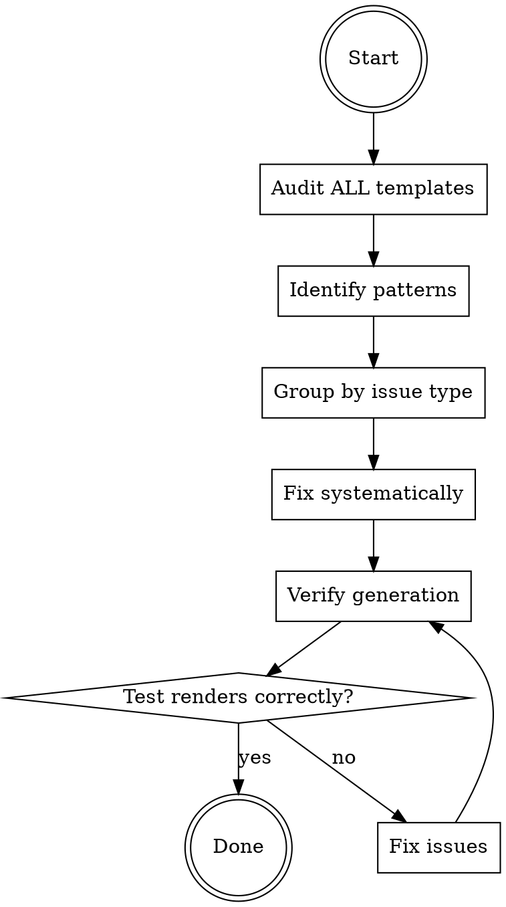

# Fixing Templates in create-faster

## Overview

Fix formatting, spacing, and syntax issues in Handlebars templates systematically.

**Core principle:** Audit comprehensively, fix consistently, verify output.

## When to Use

Use this skill when:
- Fixing indentation issues in templates
- Removing trailing/extra spaces
- Fixing typos in template files
- Cleaning up conditional formatting
- Standardizing template patterns

Do NOT use for:
- Adding new content (use `adding-templates` skill)
- Extracting from external projects (use `extracting-templates` skill)
- Updating dependency versions
- Changing template logic/functionality

## Architecture Context

**What IS a template:** `.hbs` files in `templates/` rendered by Handlebars.

**What is NOT a template** (generated programmatically, fix in code instead):
- All `package.json` files — generated by `package-json-generator.ts`
- All `.env.example` files — generated by `env-generator.ts`

### Template Directory Layout

```
templates/
├── stack/{framework}/         # Stack base files (Next.js, Expo, Hono, TanStack Start)
├── libraries/{library}/       # Per-app libraries (shadcn, better-auth, mdx, pwa, nativewind)
├── project/
│   ├── database/{provider}/   # Docker compose files (postgres, mysql)
│   ├── orm/{provider}/        # ORM config + schema (drizzle, prisma)
│   └── tooling/{tool}/        # Dev tools (biome, husky)
└── repo/{type}/               # Repo root files (single, turborepo)
```

### Template Systems

**YAML Frontmatter** (per-file configuration):
```yaml
---
path: src/lib/db/schema.ts    # Output path for single repo
mono:
  scope: app | pkg | root     # Monorepo scope
  path: schema.ts             # Monorepo path
only: mono | single           # Repo type filter
---
```

**Handlebars helpers:**
- `isMono` — check if turborepo
- `hasLibrary "name"` — check if current app has library
- `has "category" "value"` — check database/orm/tooling
- `hasContext "key"` — check if key exists in context
- `appPort appName` — get port for app
- `eq`, `ne`, `and`, `or` — logical operators

**Rendering config** (`preventIndent: false`): Handlebars auto-indents block content to match the helper's indentation. This is a major source of double-indentation issues.

**Stack-specific suffix:** `file.ext.{stack}.hbs` (e.g., `route-nextjs.ts.nextjs.hbs`) — only included for matching stack.

## Common Template Issues

### Issue 1: Trailing Spaces in Conditionals

**Problem:**
```handlebars
"start": "next start {{#if (isMono)}}--port {{appPort appName}}{{/if}}",
```

When condition is false, renders:
```json
"start": "next start ",  // ← trailing space!
```

**Fix:**
```handlebars
"start": "next start{{#if (isMono)}} --port {{appPort appName}}{{/if}}",
```

Space moved INSIDE conditional.

### Issue 2: Blank Lines from False Conditionals

When `{{#if}}` evaluates to false on its own line, Handlebars leaves a blank line.

**Problem:**
```handlebars
{{#if (hasLibrary "mdx")}}
import createMDX from '@next/mdx';
{{/if}}
import type { NextConfig } from 'next';
```

When mdx not selected: blank line before import.

**Fix options:**
- Use tilde syntax `{{~#if}}...{{~/if}}` to strip whitespace (careful: also strips newlines when true)
- Restructure to put conditional on same line as content
- Accept blank lines if they don't break output validity

### Issue 3: Adjacent Mutually-Exclusive Conditionals

**Problem:**
```handlebars
{{#if (has "database" "postgres")}}
import { pgTable } from 'drizzle-orm/pg-core';
{{/if}}
{{#if (has "database" "mysql")}}
import { mysqlTable } from 'drizzle-orm/mysql-core';
{{/if}}
```

One always false → blank line.

### Issue 4: Inconsistent Indentation

**Problem:**
```handlebars
  {{#if condition}}
    content
{{/if}}  // ← wrong indent level
```

**Fix:** Match surrounding code indentation.

### Issue 5: JSX Inline Conditionals

**Problem:**
```handlebars
<View {{#if (hasLibrary "nativewind")}}className='...'{{/if}}>
```

When false: `<View >` (trailing space).

**Fix:**
```handlebars
<View{{#if (hasLibrary "nativewind")}} className='...'{{/if}}>
```

## Systematic Fixing Process



### Step 1: Comprehensive Audit

**DO NOT fix one issue and stop. Audit ALL templates first.**

**Search for common patterns:**

```bash
# Trailing spaces before conditionals
grep -r ' {{#if' templates/

# Double spaces in conditionals
grep -r '{{#if  ' templates/

# Trailing spaces in general
grep -r ' $' templates/

# Mixed indentation (tabs vs spaces)
grep -rP '\t' templates/

# Consecutive blank lines
grep -rP '\n\n\n+' templates/

# JSX elements with inline conditionals
grep -rn '<[A-Z][a-zA-Z]* {{#if' templates/

# Adjacent mutually-exclusive conditionals
grep -rn '{{/if}}' templates/ | grep -A1 '{{#if'
```

**Count occurrences** to know the scope BEFORE starting fixes.

### Step 2: Identify Patterns

Group similar issues:

**Pattern A:** Conditional trailing spaces
- Location: inline conditionals in JSX and strings
- Fix: Move space into conditional

**Pattern B:** Blank lines from false conditionals
- Location: import sections, config objects, JSON structures
- Fix: Tilde syntax or restructure

**Pattern C:** Wrong indentation
- Location: Component files, JSON configs
- Fix: Match surrounding indent

**Pattern D:** JSON validity issues from conditionals
- Location: `tsconfig.json.hbs`, `components.json.hbs`, etc.
- Fix: Restructure to ensure valid JSON for all permutations

### Step 3: Fix Systematically

**DO ONE pattern type at a time across ALL files.**

Don't fix:
- All issues in file A, then file B

DO fix:
- All Pattern A issues across all files
- Then all Pattern B across all files

**Why:** Consistency. Same fix applied everywhere.

### Step 4: Verify Generated Output

**CRITICAL:** Don't assume visual inspection is enough.

**Test generation:**
```bash
# Single repo mode (conditionals = false)
bunx create-faster test-single --app test-single:nextjs

# Turborepo mode (conditionals = true)
bunx create-faster test-turbo --app web:nextjs --app api:hono
```

**Verify:**
- No trailing spaces in generated files
- Valid JSON syntax (test with `jq .`)
- Proper indentation
- Conditionals work correctly in both modes
- No double blank lines

### Step 5: Run Tests

```bash
cd apps/cli && bun test
```

All existing tests must pass after template changes.

## Checklist - Complete Audit Required

- [ ] Searched for trailing space patterns across ALL templates
- [ ] Counted total occurrences (know the scope)
- [ ] Grouped issues by pattern type
- [ ] Fixed one pattern type across all files
- [ ] Repeated for each pattern type
- [ ] Generated test projects (single + turborepo modes)
- [ ] Verified NO trailing spaces in generated files
- [ ] Checked JSON validity
- [ ] Ran test suite
- [ ] No visual-only inspection (must test generation)

## Common Rationalizations - STOP

| Excuse | Reality |
|--------|---------|
| "I'll just fix this one file" | Audit finds issues across many files. Systematic audit required. |
| "Visual inspection is enough" | Must test actual generation. Trailing spaces invisible. |
| "It's just spacing, not important" | Invalid JSON, broken scripts. Very important. |
| "I'll fix as I find them" | Reactive = missing 90%+ of issues. Proactive audit required. |
| "Too tedious to check all files" | `grep` does it in 2 seconds. No excuse. |
| "I need to fix package.json.hbs" | Package.json is generated programmatically, not from templates. |

## Red Flags - You're About to Fail

**STOP immediately if you think:**
- "Just this one fix is enough"
- "I can see it's fine in the template"
- "grep is overkill for this"
- "I'll check other files later"
- "Testing generation takes too long"
- "I need to look at the package.json template"

These thoughts = baseline failure pattern (fixed 1, missed 100+).

## Quick Reference - Common Greps

```bash
# Trailing spaces before conditionals (most common)
grep -rn ' {{#if' templates/

# Double spaces in conditions
grep -rn '{{#if  ' templates/

# JSX elements with inline conditionals
grep -rn '<[A-Z][a-zA-Z]* {{#if' templates/

# All trailing spaces
grep -rn ' $' templates/

# Tabs (should be spaces)
grep -rPn '\t' templates/

# Multiple blank lines
grep -rPn '\n\n\n+' templates/

# Logic bugs: eq with helper name instead of calling helper
grep -rn 'eq hasContext' templates/
grep -rn 'eq hasLibrary' templates/
```
