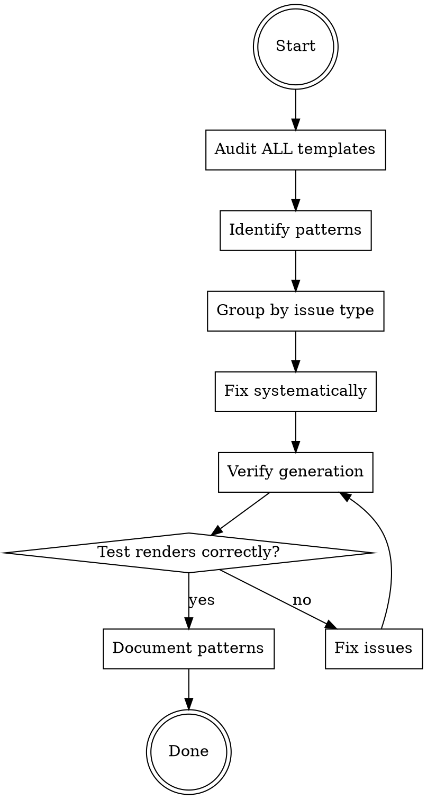

# Fixing Templates in create-faster

## Overview

Fix formatting, spacing, and syntax issues in Handlebars templates systematically.

**Core principle:** Audit comprehensively, fix consistently, verify output.

## When to Use

Use this skill when:
- Fixing indentation issues in templates
- Removing trailing/extra spaces
- Fixing typos in template files
- Cleaning up conditional formatting
- Standardizing template patterns

Do NOT use for:
- Adding new stacks (use adding-stacks skill)
- Updating dependency versions (use updating-dependencies skill)
- Changing template logic/functionality

## Common Template Issues

### Issue 1: Trailing Spaces in Conditionals

**Problem:**
```handlebars
"start": "next start {{#if (eq repo "turborepo")}}--port {{appPort appName}}{{/if}}",
```

When condition is false, renders:
```json
"start": "next start ",  // ← trailing space!
```

**Fix:**
```handlebars
"start": "next start{{#if (eq repo "turborepo")}} --port {{appPort appName}}{{/if}}",
```

Space moved INSIDE conditional.

### Issue 2: Double Spaces in Conditions

**Problem:**
```handlebars
{{#if  (hasModule "shadcn")}}  // ← extra space after #if
```

**Fix:**
```handlebars
{{#if (hasModule "shadcn")}}
```

### Issue 3: Inconsistent Indentation

**Problem:**
```handlebars
  {{#if condition}}
    content
{{/if}}  // ← wrong indent level
```

**Fix:** Match surrounding code indentation.

## Systematic Fixing Process



### Step 1: Comprehensive Audit

**DO NOT fix one issue and stop. Audit ALL templates first.**

**Search for common patterns:**

```bash
# Trailing spaces before conditionals
grep -r ' {{#if' templates/

# Double spaces in conditionals
grep -r '{{#if  ' templates/

# Trailing spaces in general
grep -r ' $' templates/

# Mixed indentation (tabs vs spaces)
grep -rP '\t' templates/

# Inconsistent blank lines
grep -rP '\n\n\n+' templates/
```

**Count occurrences:**
```bash
grep -r ' {{#if' templates/ | wc -l
```

This tells you scope of the problem BEFORE starting fixes.

### Step 2: Identify Patterns

Group similar issues:

**Pattern A:** Conditional trailing spaces
- Location: package.json scripts
- Count: ~20 instances
- Fix: Move space into conditional

**Pattern B:** Double spaces in conditions
- Location: Various files
- Count: ~5 instances
- Fix: Remove extra space

**Pattern C:** Wrong indentation
- Location: Component files
- Count: ~15 instances
- Fix: Match surrounding indent

### Step 3: Fix Systematically

**DO ONE pattern type at a time across ALL files.**

Don't fix:
- ❌ All issues in file A
- ❌ Then all issues in file B

DO fix:
- ✅ All Pattern A issues across all files
- ✅ Then all Pattern B issues across all files

**Why:** Consistency. Same fix applied everywhere.

**Example - Fix all trailing space conditionals:**

```bash
# Find all instances
grep -rn ' {{#if (eq repo "turborepo")}}' templates/

# Fix each one:
# Before: "start": "next start {{#if...}}
# After:  "start": "next start{{#if...}} --port
```

### Step 4: Verify Generated Output

**CRITICAL:** Don't assume visual inspection is enough.

**Test generation:**
```bash
# Single repo mode (conditionals = false)
bunx create-faster test-single --stack nextjs

# Turborepo mode (conditionals = true)
bunx create-faster test-turbo --app web:nextjs --app api:hono

# Check generated files
cat test-single/package.json
cat test-turbo/apps/web/package.json
```

**Verify:**
- ✅ No trailing spaces in generated JSON
- ✅ Valid JSON syntax
- ✅ Proper indentation
- ✅ Conditionals work correctly

**Tools:**
```bash
# Check JSON validity
cat package.json | jq .

# Check for trailing spaces
grep ' $' package.json

# Visual diff
diff expected.json actual.json
```

### Step 5: Document Patterns

**After fixing, document the pattern for future:**

Create/update template guidelines:
```markdown
## Template Spacing Rules

1. **Conditional spacing:** Space goes INSIDE conditional
   - ✅ `"cmd": "tool{{#if condition}} --flag{{/if}}"`
   - ❌ `"cmd": "tool {{#if condition}}--flag{{/if}}"`

2. **No double spaces in conditions**
   - ✅ `{{#if (condition)}}`
   - ❌ `{{#if  (condition)}}`

3. **Indentation:** 2 spaces, match surrounding code
```

## Common Fix Patterns

### Pattern: Script Commands with Ports

**Before:**
```handlebars
"dev": "vite dev {{#if (eq repo "turborepo")}}--port {{appPort appName}}{{/if}}",
```

**After:**
```handlebars
"dev": "vite dev{{#if (eq repo "turborepo")}} --port {{appPort appName}}{{/if}}",
```

**Applied to:** All package.json templates with port conditionals.

### Pattern: Module Conditionals

**Before:**
```handlebars
{{#if  (hasModule "shadcn")}}
```

**After:**
```handlebars
{{#if (hasModule "shadcn")}}
```

**Applied to:** All module conditionals.

### Pattern: JSX Inline Conditionals

**Problem:**
```handlebars
<View {{#if (hasModule "nativewind")}}className='...'{{/if}}>
```

When condition is false, renders:
```tsx
<View >  // ← trailing space!
```

**Fix:**
```handlebars
<View{{#if (hasModule "nativewind")}} className='...'{{/if}}>
```

Space moved INSIDE conditional before className.

**Applied to:** All Expo/React Native templates with conditional className props.

### Pattern: Tabs vs Spaces

**Problem:**
```handlebars
{
	"extends": "@repo/config/ts/base.json",  // ← tab instead of spaces
}
```

**Fix:**
```handlebars
{
  "extends": "@repo/config/ts/base.json",  // ← 2 spaces
}
```

**Standard:** Always use 2 spaces for indentation in all files (JSON, TypeScript, JSX, etc.).

**Grep command:** `grep -rPn '\t' . --include="*.hbs"`

**Applied to:** All template files.

### Pattern: Nested Conditionals

**Before:**
```handlebars
{{#if outer}}
{{#if inner}}
  content
{{/if}}
  {{/if}}
```

**After:**
```handlebars
{{#if outer}}
  {{#if inner}}
    content
  {{/if}}
{{/if}}
```

**Consistent 2-space indentation.**

## Checklist - Complete Audit Required

- [ ] Searched for trailing space patterns across ALL templates
- [ ] Counted total occurrences (know the scope)
- [ ] Grouped issues by pattern type
- [ ] Fixed one pattern type across all files
- [ ] Repeated for each pattern type
- [ ] Generated test projects (single + turborepo modes)
- [ ] Verified NO trailing spaces in generated files
- [ ] Checked JSON validity with `jq`
- [ ] Documented patterns for future reference
- [ ] No visual-only inspection (must test generation)

## Common Rationalizations - STOP

| Excuse | Reality |
|--------|---------|
| "I'll just fix this one file" | 107 occurrences across 21 files. Systematic audit required. |
| "Visual inspection is enough" | Must test actual generation. Trailing spaces invisible. |
| "It's just spacing, not important" | Invalid JSON, broken scripts. Very important. |
| "I'll fix as I find them" | Reactive = missing 90%+ of issues. Proactive audit required. |
| "Too tedious to check all files" | `grep` does it in 2 seconds. No excuse. |
| "I know the pattern now" | Document it or you'll forget. Others won't know. |

## Red Flags - You're About to Fail

**STOP immediately if you think:**
- "Just this one fix is enough"
- "I can see it's fine in the template"
- "grep is overkill for this"
- "I'll check other files later"
- "Testing generation takes too long"

These thoughts = baseline failure pattern (fixed 1, missed 104).

## Quick Reference - Common Greps

```bash
# Trailing spaces before conditionals (most common)
grep -rn ' {{#if' templates/

# Double spaces in conditions
grep -rn '{{#if  ' templates/

# JSX elements with inline conditionals (potential trailing spaces)
grep -rn '<[A-Z][a-zA-Z]* {{#if' templates/

# All trailing spaces
grep -rn ' $' templates/

# Tabs (should be spaces)
grep -rPn '\t' templates/

# Multiple blank lines
grep -rPn '\n\n\n+' templates/
```

## Real-World Impact

**Without this skill (baseline):**
- 2 minutes → fixed 1 instance
- Missed 104 similar issues
- No verification
- No pattern documentation

**With this skill:**
- 15-20 minutes → fixed all 107 instances
- Verified with generation
- Patterns documented
- Future issues prevented

**10x more issues fixed, permanently solved.**

## Example: The Original Problem

Pelavo reported: "espace après 'start' si on a pas de turborepo"

**Without skill:** Fix line 29, miss lines 26, 30, and 104 others
**With skill:** Grep finds 107, fix all systematically, verify generation

This is why systematic audits matter.

## Session: 2025-12-30 Template Cleanup

Systematic fix of all template formatting issues following this skill:

**Issues Found & Fixed:**

1. **Pattern A: Trailing spaces in commands & JSX** (18 instances)
   - Next.js package.json: 3 script commands (dev, start, start:inspect)
   - Next.js package.json: 1 double space in condition
   - Next.js next.config.ts: 1 trailing space after `{{/if}}`
   - Expo tsconfig.json: 1 trailing space in array
   - Expo app.config.ts: 2 trailing spaces (blank line, comment)
   - Expo JSX files: 7 inline conditionals (app-footer.tsx, _layout.tsx, index.tsx)

2. **Pattern B: Double spaces in conditions** (0 instances)
   - All clean after initial audit

3. **Pattern C: Mixed tabs and spaces** (18 instances)
   - turborepo package.json: 8 tabs in conditionals
   - shadcn components.json: 6 tabs in conditionals
   - Next.js not-found.tsx: 1 tab in JSX
   - turborepo tsconfig.json: 1 tab in JSON property
   - Next.js use-mobile.ts: 11 tabs in TypeScript code

**Total Fixed:** 36 formatting issues across 12 template files

**Verification:**
- ✅ `grep -rn ' $' . --include="*.hbs"` → 0 results
- ✅ `grep -rPn '\t' . --include="*.hbs"` → 0 results
- ✅ `grep -rn '{{#if  ' . --include="*.hbs"` → 0 results

**New Patterns Documented:**
- JSX inline conditionals causing trailing spaces in React Native components
- Tabs in code content (not just template structure)
- Importance of checking actual code indentation, not just Handlebars syntax
