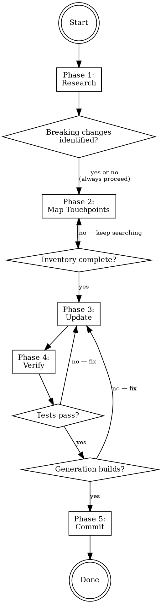

# Updating Libraries in create-faster

## Overview

Safely update library and project addon versions, catching breaking changes before they reach generated projects.

**Core principle:** Research first, inventory second, change third, verify fourth. Never change a version without understanding its full blast radius.

## When to Use

Use this skill when:
- Bumping a version in `META.libraries` or `META.project` options
- A library has released a new major/minor with breaking changes
- Adapters, plugins, or integrations have been restructured
- New peer dependencies or renamed packages

Do NOT use for:
- Adding new libraries (use `adding-templates` skill)
- Fixing template formatting (use `fixing-templates` skill)
- Updating stack frameworks (Next.js, Expo, Hono) — different surface area

**Scope:** One library/addon per invocation. Atomic commits. If a cascading peer dependency bump is needed (e.g., updating library X requires bumping library Y), that's a separate invocation.

## The Process



**Hard gates:**
- Phase 2 gates Phase 3 (no changes without complete inventory)
- Tests gate generation in Phase 4 (no generation until `bun test` passes)
- Generation gate commit in Phase 5 (no commit until generated projects build)

## Phase 1 — Research

**DO NOT skip this. DO NOT rely on assumptions about what changed.**

The baseline failure pattern is: agent reads the user's description of breaking changes and starts modifying code immediately, making assumptions about backward compatibility without verification.

### Step 1: Resolve the library with context7

```
Use context7 MCP: resolve-library-id for the library name
Then: query-docs for migration guide, changelog, breaking changes
```

If context7 doesn't have the library, move to Step 2 — web search is the fallback, not an excuse to skip research entirely.

### Step 2: Fetch changelog/migration guide

Use WebFetch or WebSearch to find:
- The library's GitHub releases page
- Migration guide (if one exists)
- Changelog entries between current and target version

At least one of Step 1 or Step 2 must produce concrete findings. If neither yields results, state this explicitly and proceed with extra caution in Phase 4 (test more combinations, not fewer).

### Step 3: Document findings

Produce a structured research summary:

```
Library: better-auth
Current: ^1.4.10
Target: ^1.5.3

Breaking changes:
- Adapters moved to separate packages (@better-auth/drizzle-adapter, @better-auth/prisma-adapter)
- Import path changed: 'better-auth/adapters/drizzle' → '@better-auth/drizzle-adapter'

New packages: @better-auth/drizzle-adapter, @better-auth/prisma-adapter
Removed packages: none (core package still exists)
Renamed APIs: none
New peer dependencies: none
New env vars: none
New configuration: none
```

**DO NOT proceed to Phase 2 without this summary.** If you can't find a changelog, state that explicitly and proceed with caution.

## Phase 2 — Map Touchpoints

**DO NOT change anything yet. Build the full inventory first.**

The baseline failure pattern is: agent finds files by browsing around, misses cross-references, and starts editing before understanding the full picture.

### 4-category systematic search

**Category 1: META entry**

Read the library/addon entry in `apps/cli/src/__meta__.ts`. Document:
- Version string
- All dependencies (including `$when` conditionals)
- Env vars
- Exports
- Require constraints
- Mono scope
- Support (which stacks)

**Category 2: Direct templates**

```bash
# For libraries:
ls apps/cli/templates/libraries/{name}/

# For project addons:
ls apps/cli/templates/project/{category}/{name}/
```

List every template file with its purpose.

**Category 3: Cross-references (CRITICAL)**

This is the most commonly missed category. Other templates conditionally reference your library:

```bash
# Search for Handlebars conditionals referencing this library
grep -rn 'hasLibrary "{name}"' apps/cli/templates/
grep -rn 'has "{category}" "{name}"' apps/cli/templates/

# Search for direct string references
grep -rn '{name}' apps/cli/templates/ --include='*.hbs'
```

For each hit: read the file, understand the conditional block, document what changes when the library is present vs absent.

**Category 4: Tests**

```bash
grep -rn '{name}' apps/cli/tests/
```

List test files and what they assert about this library.

### Produce the inventory

Format:

```
META: apps/cli/src/__meta__.ts (lines X-Y)
  - version: ^1.4.10
  - deps: better-auth, @repo/db (conditional)
  - envs: BETTER_AUTH_SECRET, BETTER_AUTH_URL
  - require: orm (drizzle|prisma)
  - mono: pkg/auth

Direct templates (N files):
  - templates/libraries/better-auth/src/lib/auth/auth.ts.hbs — server auth init
  - templates/libraries/better-auth/src/lib/auth/auth-client.ts.hbs — client auth
  - ...

Cross-references (N files):
  - templates/project/orm/drizzle/src/schema.ts.hbs — hasLibrary "better-auth" (auth tables)
  - templates/libraries/trpc/src/trpc/init.ts.hbs — hasLibrary "better-auth" (protected procedures)
  - ...

Tests (N files):
  - tests/unit/meta.test.ts — META structure assertions
  - tests/e2e/turbo.test.ts — full generation + build
  - ...
```

**DO NOT proceed to Phase 3 until this inventory is complete and presented.**

## Phase 3 — Update

Now make changes, guided by the inventory. For each file in the inventory, cross-reference with the Phase 1 research to determine what needs changing.

### Update order

1. **`__meta__.ts`** — version, dependencies, env vars, exports
2. **Direct templates** — API changes, import paths, configuration
3. **Cross-referenced templates** — only if the integration API changed
4. **Tests** — update assertions if they check specific versions or API patterns

### What NOT to change

- Don't update unrelated libraries (one at a time)
- Don't refactor templates beyond what the breaking change requires
- Don't add features that happen to be in the new version

## Phase 4 — Verify

### Step 1: Run tests

```bash
cd apps/cli && bun test
```

Fix all failures **caused by your changes** before proceeding. If there are pre-existing test failures (failures that exist on the branch before your changes), document them but don't let them block you — focus on ensuring your update doesn't introduce new failures. Compare test output against a clean run on the branch before your changes if needed.

### Step 2: Identify critical combinations

From the Phase 2 cross-references, derive which library/addon combinations produce different template output. Each `hasLibrary`/`has`/`isMono` conditional in an affected file implies a combination to test.

Example derivation for better-auth:
```
Cross-ref: drizzle/schema.ts.hbs uses hasLibrary "better-auth"
  → Test: better-auth + drizzle

Cross-ref: prisma/schema.prisma.hbs uses hasLibrary "better-auth"
  → Test: better-auth + prisma

Cross-ref: trpc/init.ts.hbs uses hasLibrary "better-auth"
  → Test: better-auth + trpc

Cross-ref: auth.ts.hbs uses has "orm" "drizzle" / has "database" "postgres"
  → Test: drizzle+postgres AND drizzle+mysql (or prisma variants)

Cross-ref: auth.ts.hbs uses isMono
  → Test: single AND turborepo
```

Deduplicate into a minimal set of generation commands that covers all conditional branches.

### Step 3: Generate and build

For each critical combination:

```bash
bunx create-faster test-X --app name:stack:libs --database X --orm X --pm bun
cd test-X && bun install && bun run build
```

**ALL generated projects must build successfully.**

### Step 4: Clean up

Remove test directories after verification.

## Phase 5 — Commit

Choose the commit message based on what changed:

- Version bump only (no template changes): `chore(meta): update {name} to {version}`
- Template changes needed: `feat(templates): update {name} templates for v{version}`

Include a brief description of breaking changes addressed in the commit body.

## Checklist

### Research (Phase 1)
- [ ] Used context7 to fetch latest library docs
- [ ] Found and read changelog/migration guide
- [ ] Documented all breaking changes with specific details
- [ ] Documented new/removed/renamed packages

### Inventory (Phase 2)
- [ ] Read META entry completely
- [ ] Listed all direct template files
- [ ] Grepped ALL templates for cross-references (`hasLibrary`, `has`)
- [ ] Grepped tests for references
- [ ] Presented complete inventory before making changes

### Update (Phase 3)
- [ ] Updated version in `__meta__.ts`
- [ ] Updated dependencies (added/removed/renamed packages)
- [ ] Updated template import paths and API calls
- [ ] Updated cross-referenced templates (only if integration API changed)
- [ ] Updated test assertions (if they check versions or API patterns)

### Verify (Phase 4)
- [ ] `bun test` passes
- [ ] Derived critical combinations from cross-reference conditionals
- [ ] Generated test projects for each combination
- [ ] `bun install && bun run build` succeeds for all generated projects
- [ ] Cleaned up test directories

### Commit (Phase 5)
- [ ] Committed with appropriate conventional commit message

## Common Rationalizations — STOP

| Excuse | Reality |
|--------|---------|
| "The user told me what changed, I don't need to research" | Users describe symptoms, not full scope. Check the docs. The changelog may reveal changes they didn't mention. |
| "I can see the files that need changing" | Browsing finds obvious files. Grep finds cross-references you'd miss. Do the systematic search. |
| "The old imports probably still work" | Probably = untested assumption. Verify with docs. If backward compat exists, the skill decides whether to use it — not assumptions. |
| "I'll just bump the version and see what breaks" | That's debugging, not updating. Research first. |
| "The tests will catch any issues" | Tests catch what they test. They don't test that generated projects actually build with the new version. Generate and verify. |
| "Testing all combinations is overkill" | Each conditional branch is a different code path in generated output. Test them. |
| "I'll check cross-references later" | Later = never. The inventory gates all changes. |
| "This is a minor version, probably no breaking changes" | Minor versions break things all the time. Research anyway. |
| "I know this library well" | You know the OLD version. The new version may differ. Check context7. |
| "Tests are already failing, so I can't verify" | Distinguish pre-existing failures from new ones. Your changes must not introduce new failures. |

## Red Flags — STOP and Re-read This Skill

- You're editing `__meta__.ts` without having produced a research summary
- You're editing templates without having produced a touchpoint inventory
- You're committing without having generated and built test projects
- You said "probably still works" about any import or API
- You found cross-references by browsing instead of grepping
- You skipped context7 because "the user already explained the changes"
- You're updating more than one library in the same pass

## Quick Reference

| Phase | Gate | Key commands |
|-------|------|-------------|
| 1. Research | Must produce research summary | context7 resolve + query-docs, WebFetch/WebSearch |
| 2. Inventory | Must present full inventory | `grep -rn 'hasLibrary "{name}"' apps/cli/templates/` |
| 3. Update | Guided by inventory | Edit `__meta__.ts`, templates, cross-refs |
| 4. Verify | Tests → Generation → Build | `bun test`, `bunx create-faster ...`, `bun run build` |
| 5. Commit | All builds pass | `git commit` |
